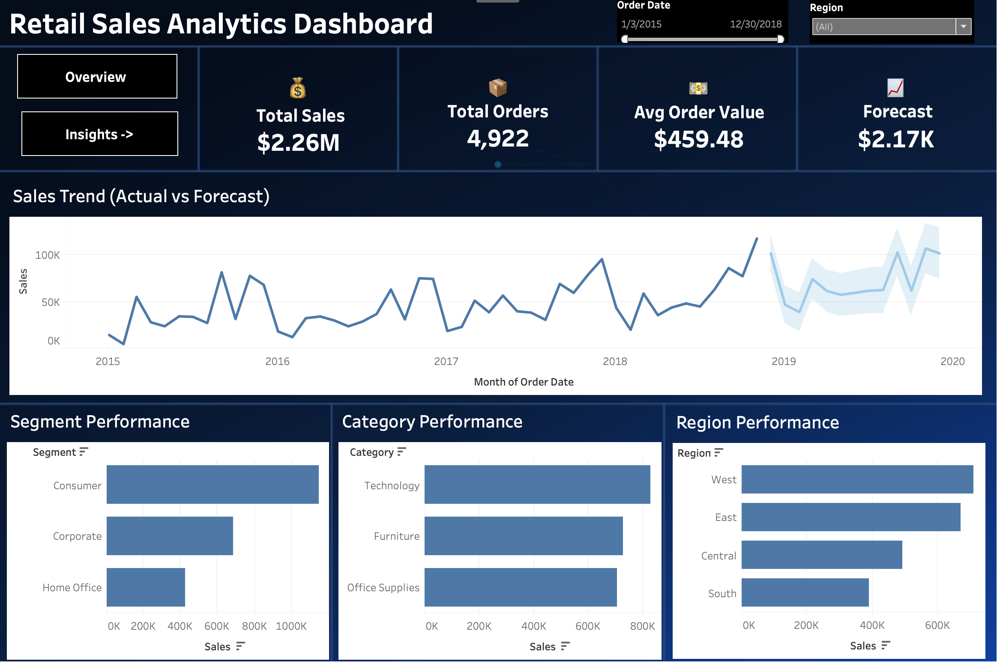
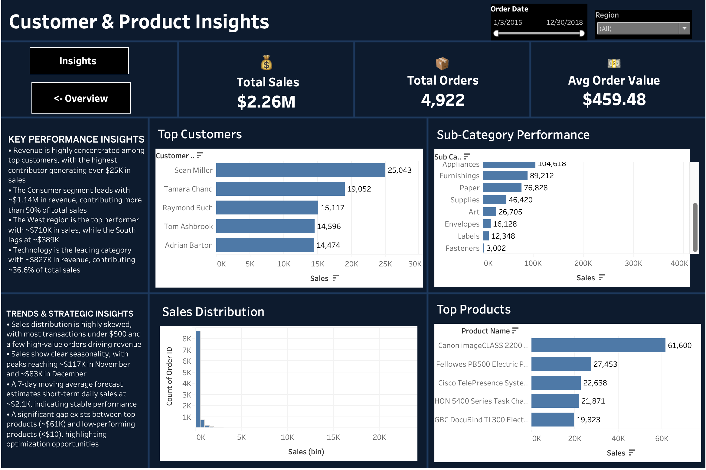

# 📊 Retail Sales Analytics & Forecasting Project

## 🚀 Overview

This project analyzes a global retail dataset to uncover business insights and forecast short-term sales. It demonstrates an end-to-end data pipeline — from raw data ingestion to transformation, analysis, and visualization.

The objective is to answer key business questions:

* Who are the top revenue-generating customers?
* Which segments and regions perform best?
* What trends exist in sales over time?
* What can we expect in the near future?

## 📁 Dataset

This project uses the **Sales Forecasting Dataset** from Kaggle:

🔗 https://www.kaggle.com/datasets/rohitsahoo/sales-forecasting/data

### 📌 Dataset Description

* Global retail (superstore-style) dataset
* Contains ~9,800 transaction-level records
* Covers multiple years of sales data
* Includes:

  * Order details (Order ID, Order Date, Ship Date)
  * Customer information (Customer ID, Name, Segment)
  * Location data (Country, City, State, Region)
  * Product details (Category, Sub-Category, Product Name)
  * Sales values


---

## 🧱 Data Pipeline

**Raw CSV → SQL Database → Data Cleaning → Python EDA → Forecasting → Tableau Dashboard**

### 🔹 Steps:

### 1. Data Ingestion

* Loaded raw CSV (`train.csv`) into a SQLite database
* Created a base table: `orders`

---

### 2. Data Cleaning & Transformation (SQL)

* Converted date fields into proper format
* Selected relevant columns
* Removed null values
* Standardized column names
* Created cleaned table: `orders_clean`

---

### 3. Data Validation (Python)

* Checked duplicate records in raw dataset
* Verified cleaned dataset contains **zero duplicates**
* Performed missing value checks

---

### 4. Exploratory Data Analysis (EDA)

Performed using Python (Pandas) and SQL:

* Sales distribution analysis
* Revenue by:

  * Customer
  * Segment
  * Region
  * Category
* Time series analysis (daily & monthly trends)
* Product performance (top & low products)
* Customer segmentation (Low / Medium / High spenders)

---

### 5. Forecasting

* Implemented **7-day moving average model**
* Predicted short-term daily sales
* Provides baseline estimate based on recent trends

---

### 6. Dashboard (Tableau)

* Interactive dashboards for business insights
* KPI cards and visual analytics
* Filter-controlled exploration

---

## 📊 Key Metrics

* **Total Sales:** ~$2.24M
* **Total Orders:** ~4,800+
* **Average Order Value:** ~$460
* **Forecast (Next Period):** ~$2.17K/day

---

## 🔍 Key Insights

### 📌 Business Performance

* Revenue is highly concentrated among top customers, with the highest contributing over **$25K**
* Consumer segment contributes **~50%+ of total revenue**
* West region leads with **~$710K**, while South underperforms (~$389K)
* Technology category dominates with **~36% contribution (~$827K)**

---

### 📌 Trends & Patterns

* Sales show strong **seasonality**, peaking in:

  * November (~$117K)
  * December (~$83K)
* Most orders are **low-value (<$500)**, with a few high-value transactions driving revenue
* Significant gap between:

  * Top products (~$61K)
  * Low-performing products (<$10)

---

### 📌 Customer Insights

* High-value customers contribute disproportionately to revenue
* Customer segmentation highlights importance of retention strategies
* Opportunity to improve engagement of low-value customers

---

## 📈 Forecasting Insight

* 7-day moving average predicts **~$2.17K daily sales**
* Indicates stable short-term performance
* Can be extended using advanced time series models

---

## 🛠️ Tech Stack

* **SQL (SQLite)** → Data storage & transformation
* **Python (Pandas)** → Data analysis & EDA
* **Tableau** → Dashboard & visualization

---

## 📊 Dashboard Features

* KPI summary (Sales, Orders, AOV, Forecast)
* Sales trend with forecast
* Sales distribution (histogram)
* Category, region, and segment analysis
* Customer and product insights
* Interactive filters (Date, Region)
## 📊 Dashboard Preview

### 🔹 Sales Overview Dashboard



### 🔹 Customer & Product Insights



---

## 📂 Project Structure

```
data_analyst_project/
│
├── data/
│   └── train.csv
├── output/
│   └── export_data.py
│   └── clean_data.csv
│
├── sql/
│   ├──  database_setup.py
│   ├── sales.db
│   ├── transformation.sql
│   ├── analysis.py
│   ├── forecast.csv
│   ├── run_sql.py
├── Tableau_dashboard/
│   └── Dashboard1
│   └── Dashboard2
│
└── README.md
```

---

## 💡 Business Recommendations

* Focus on retaining high-value customers
* Invest more in top-performing regions (West)
* Improve performance in underperforming regions (South)
* Optimize product portfolio (reduce low-performing products)
* Leverage seasonal trends for marketing & inventory planning

---

## 📌 Conclusion

This project demonstrates a complete data workflow:

* Data cleaning & validation
* Exploratory analysis
* Business insight generation
* Forecasting
* Interactive dashboarding

It highlights how data can be used to drive decision-making and business strategy.

---
